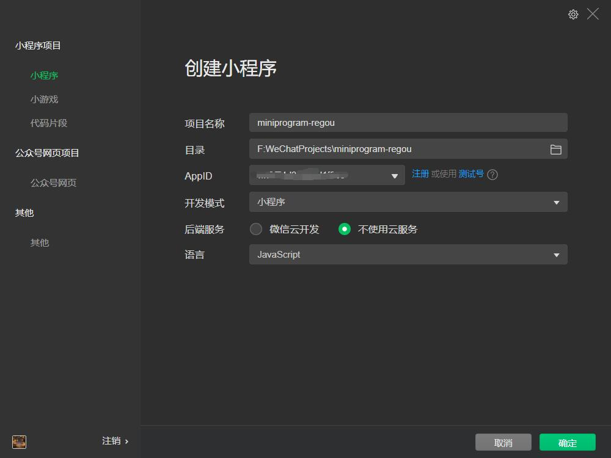
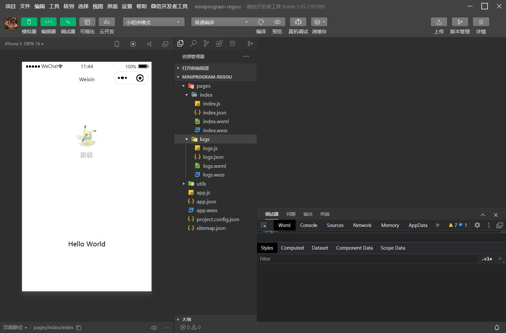
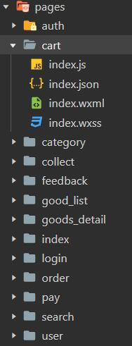
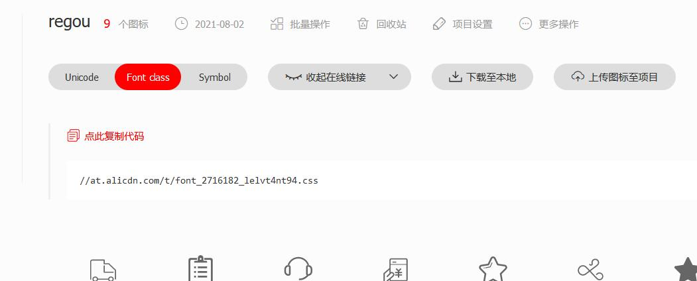
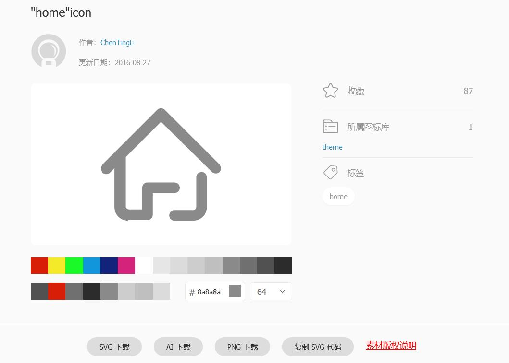
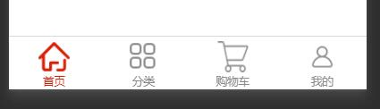
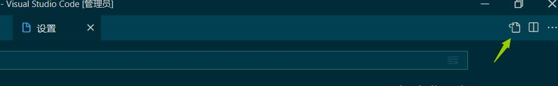
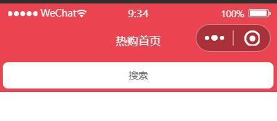

# 微信小程序入门

## 小程序的第三方框架

1. 腾讯`wepy`类似于`vue`
2. 美团`mpvue`语法类似于`vue`
3. 京东taro类似于react
4. 滴滴chameleon
5. `uni-app`类似于`vue`
6. 原生框架MINA

这里使用原生框架MINA

## 微信公众平台

https://mp.weixin.qq.com/

前往微信公众平台注册小程序和开发者工具

## 创建项目

#### 初始化项目

创建：





删除无关代码，以便重新构建项目：

`app.json`：去掉logs页配置&修改标题&删除logs目录

```json
{
  "pages":[
    "pages/index/index"
  ],
  "window":{
    "backgroundTextStyle":"light",
    "navigationBarBackgroundColor": "#fff",
    "navigationBarTitleText": "yngwejun热购",
    "navigationBarTextStyle":"black"
  },
  "style": "v2",
  "sitemapLocation": "sitemap.json"
}
```

清空`app.wxss`

...等

`index.json`:

```json
{
  "usingComponents": {},
  "navigationBarTitleText": "热购首页"
}
```

保存

#### 构建项目目录结构

| 目录名     | 作用         |
| ---------- | ------------ |
| styles     | 存放公共样式 |
| components | 存放组件     |
| libs       | 存放第三方库 |
| utils      | 工具         |
| request    | 接口         |

#### 搭建项目页面

| 页面名称         | 文件         |
| ---------------- | ------------ |
| 首页             | index        |
| 分类页面         | category     |
| 商品列表页面     | good_list    |
| 商品列表详情页面 | goods_detail |
| 购物车页面       | cart         |
| 收藏页面         | collect      |
| 订单页面         | order        |
| 搜索页面         | search       |
| 个人中心页面     | user         |
| 意见反馈页面     | feedback     |
| 登录页面         | login        |
| 授权页面         | auth         |
| 结算页面         | pay          |

`appjson`

```json
"pages":[
    "pages/index/index",
    "pages/category/index",
    "pages/good_list/index",
    "pages/goods_detail/index",
    "pages/cart/index",
    "pages/collect/index",
    "pages/order/index",
    "pages/search/index",
    "pages/user/index",
    "pages/feedback/index",
    "pages/login/index",
    "pages/auth/index",
    "pages/pay/index"
  ],
```

`ctr+s`



#### 使用字体

1. 阿里巴巴字体图标库：



2. 在项目`styles`目录下创建`icfont.wxss`文件，复制以上链接的代码。

3. 在`app.wxss`中引入

```css
@import "./styles/icfont.wxss";
```

4. 在页面中引用

```html
<text class="iconfont icon-order"></text>
```

## 底部导航菜单

为了方便，在阿里的图标字体库，下载`png`图片,然后放入文件夹`icons`下



在`app.json`加入配置项`tabBar`

```json
"tabBar": {
    "color": "#8a8a8a",
    "selectedColor": "#d81e06",
    "backgroundColor": "#ffffff",
    "list": [{
        "pagePath": "pages/index/index",
        "text": "首页",
        "iconPath": "icons/home.png",
        "selectedIconPath": "icons/home-01.png"
      },
      {
        "pagePath": "pages/category/index",
        "text": "分类",
        "iconPath": "icons/cate.png",
        "selectedIconPath": "icons/cate-01.png"
      },
      {
        "pagePath": "pages/cart/index",
        "text": "购物车",
        "iconPath": "icons/cart.png",
        "selectedIconPath": "icons/cart-01.png"
      },
      {
        "pagePath": "pages/user/index",
        "text": "我的",
        "iconPath": "icons/wode.png",
        "selectedIconPath": "icons/wode-01.png"
      }
    ]
  },
```

此时底部效果就出来了



## 搜索框

在components目录下右键，选择新建components，名为SearchInput。
在SearchInputwxml中：
```html
<view class="search_input">
  <navigator url="/pages/search/index" open-type="navigate">搜索</navigator>
</view>
```

在index中引入，`index.json`:
```json
"usingComponents": {
    "SearchInput": "../../components/SearchInput/SearchInput"
  },
  ```

  我们用vscode编写代码，用微信开发者工具预览，在vscode中下载插件，小程序开发助手和 Easy WXLESS，点击设置打开，右上角的json设置
  
  添加配置：保存less会在当前目录生成一个对应的wxml
```json
"less.compile": {
    "outExt": ".wxss"
}
```
 在SearchInput.less中添加搜索框样式,ctr+s保存
  ```css
  .search_input {
  height: 90rpx;
  padding: 10rpx;
  background-color: var(--themeColor);
  navigator {
    display: flex;
    justify-content: center;
    align-items: center;
    background-color: #fff;
    border-radius: 15rpx;
  }
}
```

在主页面index.wxml中使用搜索框组件
```html
<!--index.wxml-->
<view class="rg_index">
  <!-- 搜索框 -->
  <SearchInput></SearchInput>
</view>
```
效果：点击搜索框会跳转到搜索页

